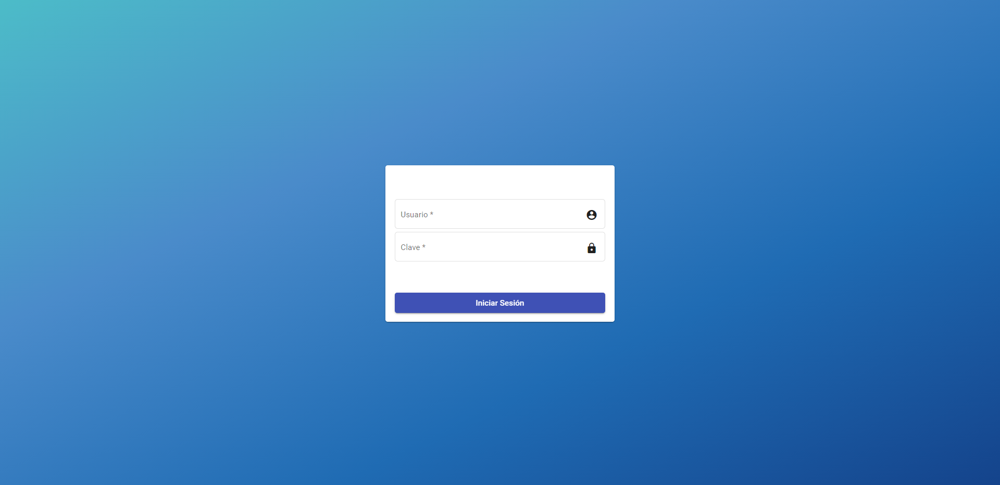
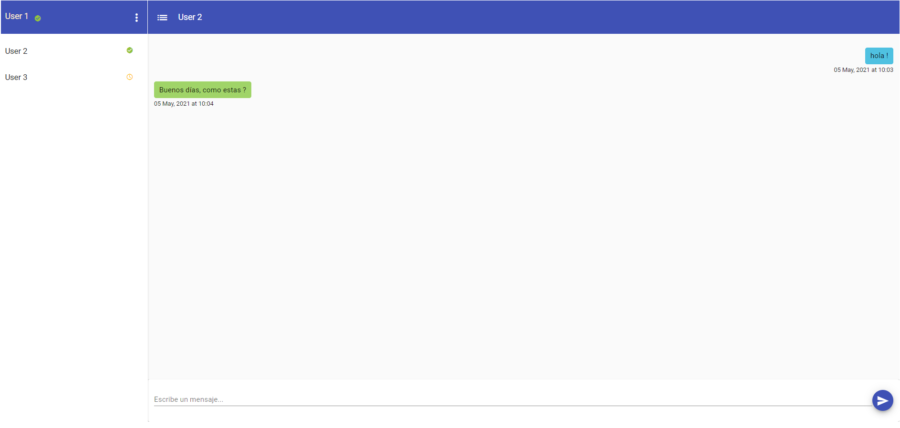
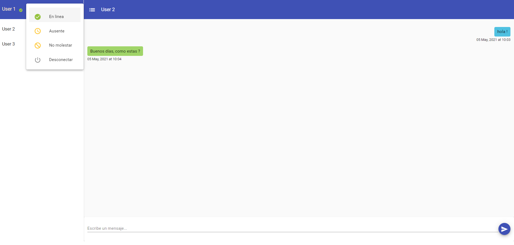

# Chat

Aplicación para chat una a uno (one-to-one)

## Funcionalidades 

* Permite la comunicación por medio de intercambio de mensajes en tiempo real utilizando websocket.

## Construido con 🛠️

Este proyecto esta construido con las siguientes tecnologias:

## Backend 

* Java 11
* Spring-websocket
* Spring-web
* Spring Data MongoDB
* Maven
* mongoDB
* Sptring Security
* Jwt (Json Web Token)

### El proyecto backend construida con los siguientes componentes:
   * Model: Objetos que se usan para la comunicación a través de las API
   * Controller: Responde a eventos lanzados por el usuario desde la web.
   * Service: Implementa la logica de procesamiento de información y la logica de negocio.
   * Repository: Interfaces para la base de datos, guarda, elimina y consulta.
   * Model: modelos para los documento de la base de datos mongoDB.
   

## Frontend

* Angular 11
* Material angular

## Autenticacion

Para hacer uso del chat es necesario utilizar un servicio de autenticacion, podra encontrar el sericio que se utilizo en el siguiente [enlace](https://github.com/jhonfre1994/oauth2-jwt-spring-boot-example). Ahi encontrara mas información sobre el servicio de autenticacion construido. 

## Capturas de pantalla

* Login	

* Chat.

* Cambio de estados del usuario.

## Autores ✒️

* **Jhon Freddy salamanca** - [jhonfre1994](https://github.com/jhonfre1994)

## Licencia 📄

Este proyecto está bajo la Licencia (MIT) - mira el archivo [LICENSE.md](https://github.com/jhonfre1994/multi-tenant-spring-boot/blob/main/LICENSE) para detalles

